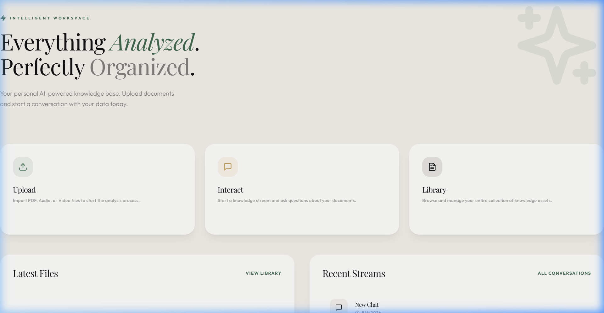
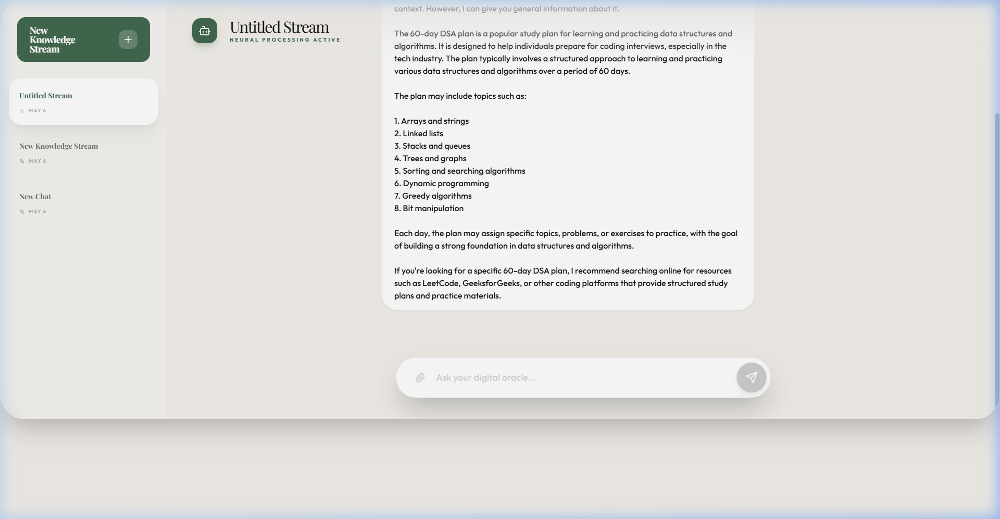
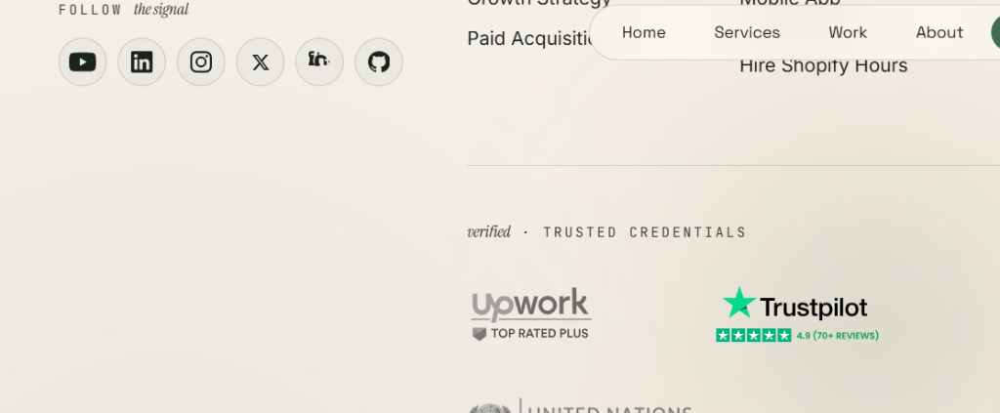
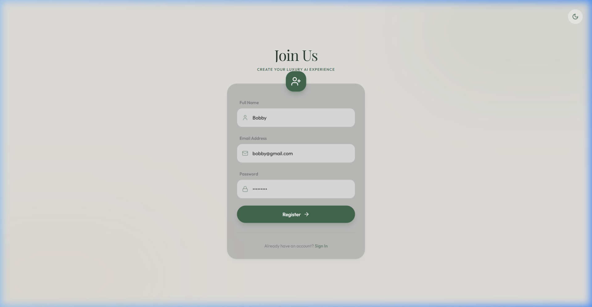
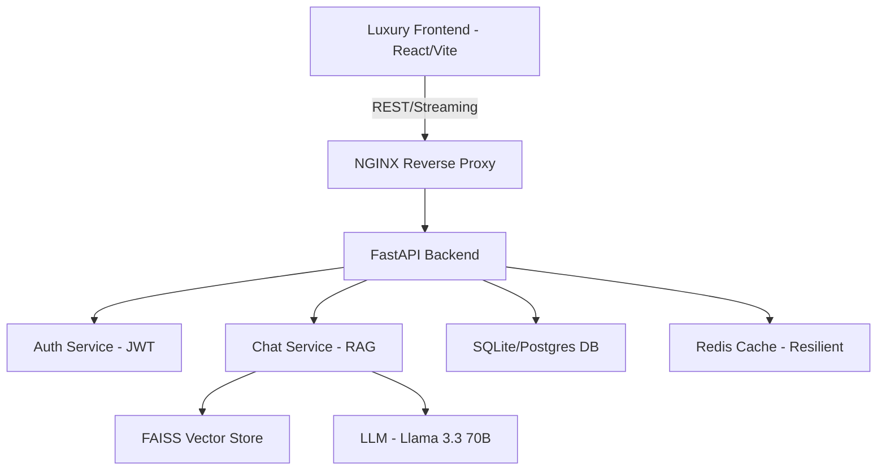

<p align="center">
  
</p>

<h1 align="center">💎 DocuMind AI: The Luxury Knowledge Vault</h1>

<p align="center">
  <strong>A premium, production-grade document intelligence platform with glassmorphic UI and multi-modal analysis.</strong>
</p>

<p align="center">
  
  
  
  
  
  
  
  
</p>

<p align="center">
  
  
  
  
</p>

---

## 🖼️ Product Showcase

### 🌓 Immersive Luxury Experience

| Feature | Visual Preview |
|:---:|:---:|
| **Luxury Dashboard** |  |
| **Immersive Knowledge Stream** |  |
| **Media Vault (Library)** |  |
| **Authentication Flow** |  |

---

## ✨ Features

<table>
<tr>
<td width="50%">

### 🧠 Advanced Neural Analysis
- **Llama 3.3 70B Orchestration** via Groq
- **Multi-Modal Support**: PDF, Audio (MP3/WAV), Video (MP4)
- Intelligent Context Retrieval (RAG)
- Automated Document Summarization
- Streaming AI responses for real-time interaction
- **Token Safety Guards**: Auto-truncation of messages, context, and history to stay within LLM provider limits

</td>
<td width="50%">

### 🏗️ Enterprise Backend
- **Service-Oriented Architecture** (SOA)
- **FAISS Vector Search** for semantic indexing
- **Resilient Infrastructure**: Automatic Redis-fallback
- Structured Logging & Middleware Guards
- JWT-based Auth with Platform-independent GUIDs

</td>
</tr>
<tr>
<td width="50%">

### 📂 Digital Vault (Library)
- Centralized Knowledge Management
- Advanced filtering and document tracking
- File metadata extraction (Size, Type, Status)
- One-click "Knowledge Stream" initialization
- Seamless upload-to-chat workflow

</td>
<td width="50%">

### 🎨 Immersive Luxury UI
- **Digital Heroes Design System** (Sage & Cream)
- **Full-Screen Immersive Chat** (Edge-to-edge)
- **Glassmorphic Navigation** & Layered Blurs
- **Theme Sync**: Deep Dark & Warm Light modes
- Micro-animations via Tailwind & Lucide
- Modern Typography: **Playfair Display + Outfit**

</td>
</tr>
</table>

---

## 🏛️ System Architecture



---

## 🎨 Design System: "Digital Heroes"

The application features a bespoke **Luxury Design System** that prioritizes visual excellence and user immersion.

- **Tokenized Palette**: Uses `#436850` (Sage Green) for primary actions and `#F2EFEA` (Luxury Cream) for backgrounds.
- **Glassmorphic Glass**: Navigation and cards use high-opacity blurs (`backdrop-blur-3xl`) and subtle white borders to simulate premium glass.
- **Typography Focus**: Combines the authority of Serif (Playfair Display) for headers with the clarity of Sans (Outfit) for data.
- **Immersive Chat**: The "Knowledge Stream" interface is fully edge-to-edge, removing distractions and focusing entirely on the AI-User interaction.

---

## 🚀 Quick Start

### 📦 Option 1: Docker Compose (Full Stack)

```bash
# Clone the repository
git clone <repo-url>
cd ai-doc-qa-app

# Build and start all services (Backend, Frontend, Redis, Nginx)
docker-compose up --build
```

### 🐍 Option 2: Local Backend Development

```bash
cd backend
python -m venv venv
./venv/Scripts/activate
pip install -r requirements.txt
# Run the server
uvicorn main:app --reload --host 0.0.0.0 --port 8000
```

### ⚛️ Option 3: Local Frontend Development

```bash
cd frontend
npm install
npm run dev
```

---

## ⚠️ Groq Tier & Token Limits

This project uses **Groq** as the default LLM provider (`llama-3.3-70b-versatile`). The `on_demand` service tier has a **12,000 token-per-minute (TPM)** limit per request.

To handle large documents and pasted content safely, the backend applies automatic safeguards:
- **Per-message limit**: 1,500 characters (history messages)
- **Context limit**: 2,500 characters (retrieved document chunks)
- **History window**: Last 8 messages only
- **Pre-send token guard**: Drops older history and truncates context if the estimate exceeds 10,000 tokens

> **Tip**: If you frequently process very large PDFs, consider upgrading to the [Groq Dev Tier](https://console.groq.com/settings/billing) for higher TPM limits, or switch to a model/provider with a larger context window via the `MODEL_NAME` and `XAI_BASE_URL` environment variables.

---

## © Copyright Notice

**© 2026 DocuMind AI. All Rights Reserved.**

---

## 👨‍💻 Developed by

<div align="center">
  <a href="https://www.linkedin.com/in/sudheerkonduboina/">
    
  </a>
  <br/>
  <h3>Sudheer Konduboina</h3>
  <p>Software Engineer (Backend) & AI Specialist</p>
  <a href="https://www.linkedin.com/in/sudheerkonduboina/">
    
  </a>
</div>
