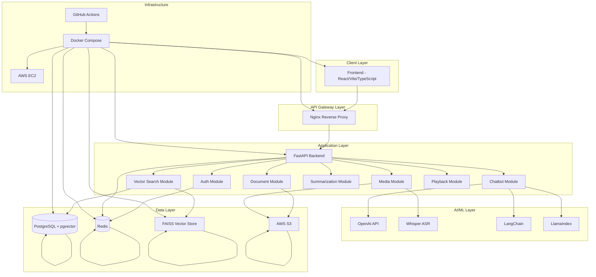

# High-Level Architecture Diagram

## Architecture Overview

### Client Layer
- **Frontend**: React + Vite + TypeScript
- Modern SaaS UI with streaming chat, drag-drop uploads, media player

### API Gateway Layer
- **Nginx**: Reverse proxy, SSL termination, load balancing

### Application Layer
- **FastAPI**: High-performance async Python framework
- Modular architecture with feature-based separation
- JWT authentication, rate limiting, caching

### AI/ML Layer
- **OpenAI API**: GPT models for chat and summarization
- **Whisper**: Audio/video transcription
- **LangChain + LlamaIndex**: RAG pipeline orchestration

### Data Layer
- **PostgreSQL + pgvector**: Relational data + vector similarity
- **Redis**: Caching, rate limiting, session management
- **FAISS**: High-performance vector search
- **AWS S3**: File storage (documents, media)

### Infrastructure
- **Docker Compose**: Multi-container orchestration
- **GitHub Actions**: CI/CD pipeline
- **AWS EC2**: Production deployment
