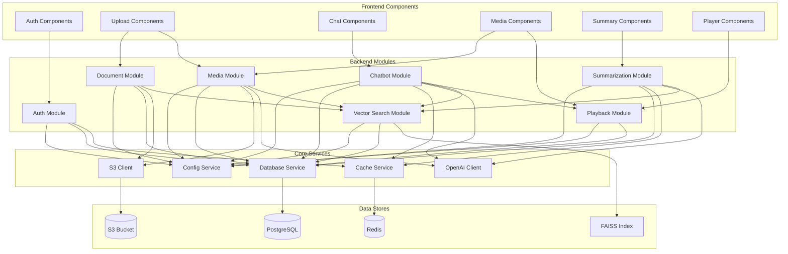

# Component Diagram

## Component Details

### Frontend Components

#### Auth Components
- `LoginPage`: User login form
- `RegisterPage`: User registration form
- `AuthGuard`: Route protection wrapper
- `AuthProvider`: Authentication context

#### Upload Components
- `UploadCenter`: Drag-drop upload interface
- `FileUploader`: Individual file upload handler
- `UploadProgress`: Progress indicator
- `FileList`: Uploaded files display

#### Chat Components
- `ChatInterface`: Main chat UI
- `MessageList`: Message history display
- `MessageItem`: Single message component
- `ChatInput`: Input field with send button
- `TimestampBadge`: Clickable timestamp indicator
- `StreamingResponse`: Real-time token display

#### Media Components
- `MediaLibrary`: File browser
- `MediaCard`: File preview card
- `MediaFilter`: Filter controls
- `MediaSearch`: Search functionality

#### Summary Components
- `SummaryViewer`: Summary display
- `SummaryCard`: Individual summary
- `SummaryActions`: Edit/regenerate options

#### Player Components
- `MediaPlayer`: Video/audio player
- `TimestampControls`: Jump to segment
- `PlaybackControls`: Play/pause/seek

### Backend Modules

#### Auth Module
- `controller.py`: Request handlers
- `service.py`: Business logic
- `repository.py`: Data access
- `schemas.py`: Pydantic models
- `models.py`: SQLAlchemy models
- `router.py`: FastAPI routes

#### Document Module
- PDF text extraction
- Document chunking
- Metadata storage
- S3 upload handling

#### Media Module
- Audio/video upload
- Whisper transcription
- Timestamp extraction
- S3 storage

#### Chatbot Module
- RAG pipeline
- Context injection
- Streaming responses
- Query processing

#### Summarization Module
- Auto-summary generation
- On-demand summarization
- Summary storage

#### Vector Search Module
- FAISS index management
- Embedding generation
- Semantic search
- pgvector operations

#### Playback Module
- Timestamp mapping
- Segment extraction
- Playback API

### Core Services

#### Config Service
- Environment variable loading
- Configuration validation
- Settings management

#### Database Service
- Connection pooling
- Session management
- Migration handling

#### Cache Service
- Redis connection
- Cache operations
- Rate limiting

#### S3 Client
- File upload/download
- Bucket management
- URL generation

#### OpenAI Client
- API authentication
- Request handling
- Response parsing
