# Data Flow Diagram

```mermaid
graph LR
    subgraph "Upload Flow"
        A[User Uploads File] --> B[Frontend Validates]
        B --> C[API: POST /upload]
        C --> D[Auth: JWT Validation]
        D --> E[Module: File Processing]
        E --> F{File Type?}
        F -->|PDF| G[Extract Text]
        F -->|Audio/Video| H[Whisper Transcription]
        G --> I[Chunk Document]
        H --> I
        I --> J[Generate Embeddings]
        J --> K[Store in FAISS]
        J --> L[Store in pgvector]
        E --> M[Upload to S3]
        E --> N[Save Metadata to PostgreSQL]
        N --> O[Cache in Redis]
        O --> P[Return File ID]
    end
    
    subgraph "Chat Query Flow"
        Q[User Sends Query] --> R[API: POST /chat]
        R --> S[Auth: JWT Validation]
        S --> T[Rate Limit Check]
        T --> U[Check Cache]
        U -->|Cache Hit| V[Return Cached Response]
        U -->|Cache Miss| W[Vector Search]
        W --> X[Retrieve Relevant Chunks]
        X --> Y[Build Context]
        Y --> Z[OpenAI API Call]
        Z --> AA[Stream Response]
        AA --> AB[Extract Timestamps]
        AB --> AC[Cache Response]
        AC --> AD[Stream to Client]
    end
    
    subgraph "Playback Flow"
        AE[User Clicks Timestamp] --> AF[API: GET /playback]
        AF --> AG[Auth: JWT Validation]
        AG --> AH[Retrieve Transcript]
        AH --> AI[Extract Segment]
        AI --> AJ[Return Start/End Times]
        AJ --> AK[Frontend Jumps Player]
    end
    
    subgraph "Summarization Flow"
        AL[File Uploaded] --> AM[Trigger Auto-Summary]
        AM --> AN[Retrieve Chunks]
        AN --> AO[OpenAI Summary API]
        AO --> AP[Store Summary]
        AP --> AQ[User Requests Summary]
        AQ --> AR[API: GET /summary]
        AR --> AS[Return Summary]
    end
```

## Data Flow Details

### Upload Flow

1. **User Uploads File**
   - Frontend validates file type and size
   - Shows upload progress

2. **API Processing**
   - JWT authentication validates user
   - Rate limiting checks upload frequency

3. **File Processing**
   - PDF: Extract text using PyPDF2
   - Audio/Video: Transcribe using Whisper
   - Chunk documents into segments (500-1000 tokens)

4. **Embedding Generation**
   - Use OpenAI text-embedding-3-small
   - Generate vectors for each chunk
   - Store in FAISS for fast search
   - Store in pgvector for hybrid queries

5. **Storage**
   - Upload original file to S3
   - Save metadata to PostgreSQL
   - Cache file info in Redis

6. **Response**
   - Return file ID to frontend
   - Trigger auto-summarization

### Chat Query Flow

1. **User Query**
   - Frontend sends query with file context
   - Include JWT token

2. **Authentication & Rate Limiting**
   - Validate JWT token
   - Check Redis rate limits (e.g., 100 queries/min)

3. **Cache Check**
   - Check Redis for cached response
   - Return immediately if cache hit

4. **Vector Search**
   - Generate query embedding
   - Search FAISS for top-k similar chunks
   - Filter by user ID (multi-tenant isolation)

5. **Context Building**
   - Retrieve relevant chunks from PostgreSQL
   - Include timestamps for media files
   - Build prompt with context

6. **OpenAI API Call**
   - Send prompt to GPT-4
   - Stream response tokens
   - Extract timestamp references

7. **Caching & Response**
   - Cache response in Redis (TTL: 1 hour)
   - Stream tokens to frontend in real-time
   - Include clickable timestamp badges

### Playback Flow

1. **User Interaction**
   - User clicks timestamp badge in chat
   - Frontend requests playback segment

2. **API Processing**
   - Validate JWT token
   - Check user has access to file

3. **Segment Extraction**
   - Retrieve transcript from PostgreSQL
   - Extract segment around timestamp
   - Calculate start/end times (±30 seconds)

4. **Response**
   - Return start/end times
   - Frontend jumps media player to position

### Summarization Flow

1. **Auto-Summary Trigger**
   - After successful upload
   - Background task initiated

2. **Summary Generation**
   - Retrieve document chunks
   - Send to OpenAI for summarization
   - Generate concise summary

3. **Storage**
   - Save summary to PostgreSQL
   - Link to original file

4. **On-Demand Request**
   - User requests summary
   - API retrieves from database
   - Return formatted summary
