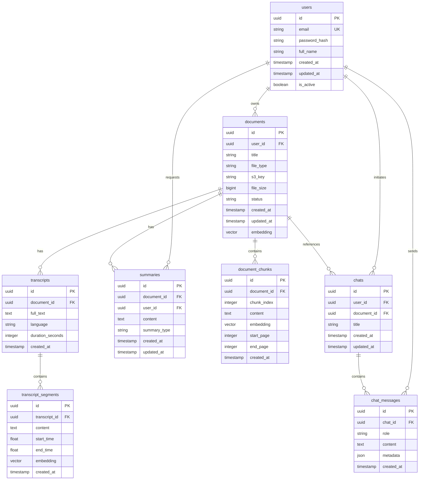

# Database Schema

## Entity Relationship Diagram



## Table Definitions

### users

```sql
CREATE TABLE users (
    id UUID PRIMARY KEY DEFAULT gen_random_uuid(),
    email VARCHAR(255) UNIQUE NOT NULL,
    password_hash VARCHAR(255) NOT NULL,
    full_name VARCHAR(255) NOT NULL,
    created_at TIMESTAMP DEFAULT CURRENT_TIMESTAMP,
    updated_at TIMESTAMP DEFAULT CURRENT_TIMESTAMP,
    is_active BOOLEAN DEFAULT TRUE
);

CREATE INDEX idx_users_email ON users(email);
```

### documents

```sql
CREATE TABLE documents (
    id UUID PRIMARY KEY DEFAULT gen_random_uuid(),
    user_id UUID NOT NULL REFERENCES users(id) ON DELETE CASCADE,
    title VARCHAR(500) NOT NULL,
    file_type VARCHAR(50) NOT NULL, -- 'pdf', 'audio', 'video'
    s3_key VARCHAR(500) NOT NULL,
    file_size BIGINT NOT NULL,
    status VARCHAR(50) DEFAULT 'processing', -- 'processing', 'completed', 'failed'
    created_at TIMESTAMP DEFAULT CURRENT_TIMESTAMP,
    updated_at TIMESTAMP DEFAULT CURRENT_TIMESTAMP
);

CREATE INDEX idx_documents_user_id ON documents(user_id);
CREATE INDEX idx_documents_status ON documents(status);
CREATE INDEX idx_documents_created_at ON documents(created_at DESC);

-- Add pgvector extension
CREATE EXTENSION IF NOT EXISTS vector;

-- Add embedding column for hybrid search
ALTER TABLE documents ADD COLUMN embedding vector(1536);
CREATE INDEX idx_documents_embedding ON documents USING ivfflat (embedding vector_cosine_ops) WITH (lists = 100);
```

### document_chunks

```sql
CREATE TABLE document_chunks (
    id UUID PRIMARY KEY DEFAULT gen_random_uuid(),
    document_id UUID NOT NULL REFERENCES documents(id) ON DELETE CASCADE,
    chunk_index INTEGER NOT NULL,
    content TEXT NOT NULL,
    embedding vector(1536),
    start_page INTEGER,
    end_page INTEGER,
    created_at TIMESTAMP DEFAULT CURRENT_TIMESTAMP
);

CREATE INDEX idx_chunks_document_id ON document_chunks(document_id);
CREATE INDEX idx_chunks_chunk_index ON document_chunks(document_id, chunk_index);
CREATE INDEX idx_chunks_embedding ON document_chunks USING ivfflat (embedding vector_cosine_ops) WITH (lists = 100);
```

### transcripts

```sql
CREATE TABLE transcripts (
    id UUID PRIMARY KEY DEFAULT gen_random_uuid(),
    document_id UUID NOT NULL REFERENCES documents(id) ON DELETE CASCADE,
    full_text TEXT NOT NULL,
    language VARCHAR(10) DEFAULT 'en',
    duration_seconds INTEGER,
    created_at TIMESTAMP DEFAULT CURRENT_TIMESTAMP
);

CREATE INDEX idx_transcripts_document_id ON transcripts(document_id);
```

### transcript_segments

```sql
CREATE TABLE transcript_segments (
    id UUID PRIMARY KEY DEFAULT gen_random_uuid(),
    transcript_id UUID NOT NULL REFERENCES transcripts(id) ON DELETE CASCADE,
    content TEXT NOT NULL,
    start_time FLOAT NOT NULL,
    end_time FLOAT NOT NULL,
    embedding vector(1536),
    created_at TIMESTAMP DEFAULT CURRENT_TIMESTAMP
);

CREATE INDEX idx_segments_transcript_id ON transcript_segments(transcript_id);
CREATE INDEX idx_segments_time ON transcript_segments(start_time, end_time);
CREATE INDEX idx_segments_embedding ON transcript_segments USING ivfflat (embedding vector_cosine_ops) WITH (lists = 100);
```

### chats

```sql
CREATE TABLE chats (
    id UUID PRIMARY KEY DEFAULT gen_random_uuid(),
    user_id UUID NOT NULL REFERENCES users(id) ON DELETE CASCADE,
    document_id UUID REFERENCES documents(id) ON DELETE SET NULL,
    title VARCHAR(500),
    created_at TIMESTAMP DEFAULT CURRENT_TIMESTAMP,
    updated_at TIMESTAMP DEFAULT CURRENT_TIMESTAMP
);

CREATE INDEX idx_chats_user_id ON chats(user_id);
CREATE INDEX idx_chats_document_id ON chats(document_id);
CREATE INDEX idx_chats_created_at ON chats(created_at DESC);
```

### chat_messages

```sql
CREATE TABLE chat_messages (
    id UUID PRIMARY KEY DEFAULT gen_random_uuid(),
    chat_id UUID NOT NULL REFERENCES chats(id) ON DELETE CASCADE,
    role VARCHAR(20) NOT NULL, -- 'user', 'assistant', 'system'
    content TEXT NOT NULL,
    metadata JSONB,
    created_at TIMESTAMP DEFAULT CURRENT_TIMESTAMP
);

CREATE INDEX idx_messages_chat_id ON chat_messages(chat_id);
CREATE INDEX idx_messages_created_at ON chat_messages(created_at ASC);
```

### summaries

```sql
CREATE TABLE summaries (
    id UUID PRIMARY KEY DEFAULT gen_random_uuid(),
    document_id UUID NOT NULL REFERENCES documents(id) ON DELETE CASCADE,
    user_id UUID NOT NULL REFERENCES users(id) ON DELETE CASCADE,
    content TEXT NOT NULL,
    summary_type VARCHAR(50) DEFAULT 'auto', -- 'auto', 'on_demand'
    created_at TIMESTAMP DEFAULT CURRENT_TIMESTAMP,
    updated_at TIMESTAMP DEFAULT CURRENT_TIMESTAMP
);

CREATE INDEX idx_summaries_document_id ON summaries(document_id);
CREATE INDEX idx_summaries_user_id ON summaries(user_id);
CREATE INDEX idx_summaries_type ON summaries(summary_type);
```

## Vector Search Strategy

### FAISS (Primary)
- Local in-memory index for fast retrieval
- Used for real-time chat queries
- IndexType: IndexFlatIP (inner product)
- Dimension: 1536 (OpenAI embeddings)

### pgvector (Secondary)
- Persistent vector storage
- Used for hybrid queries with metadata filtering
- IVFFlat index for approximate search
- Cosine similarity distance metric

### Embedding Strategy
- Document chunks: text-embedding-3-small
- Transcript segments: text-embedding-3-small
- Query: text-embedding-3-small
- Dimension: 1536
