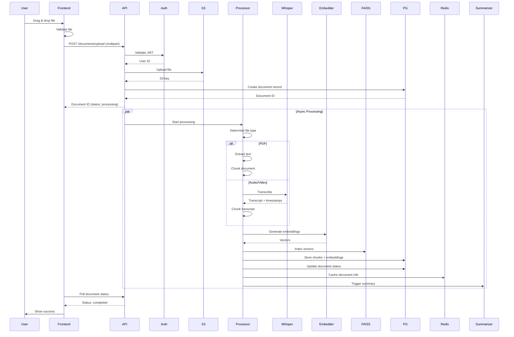
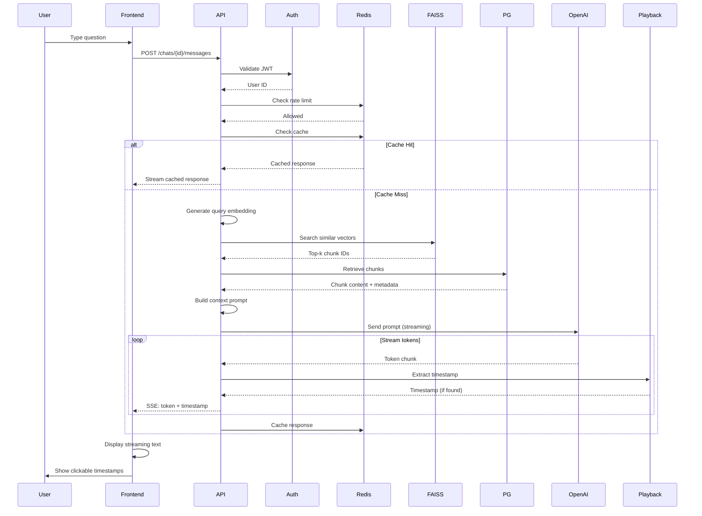
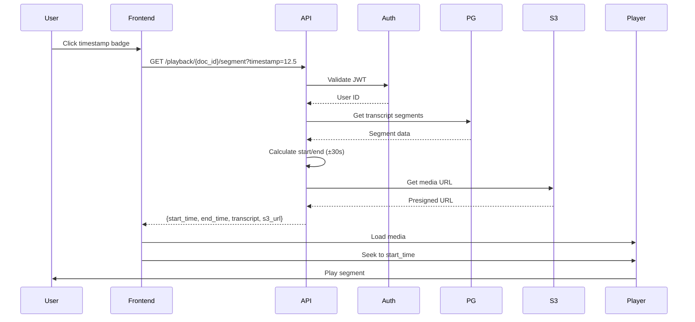
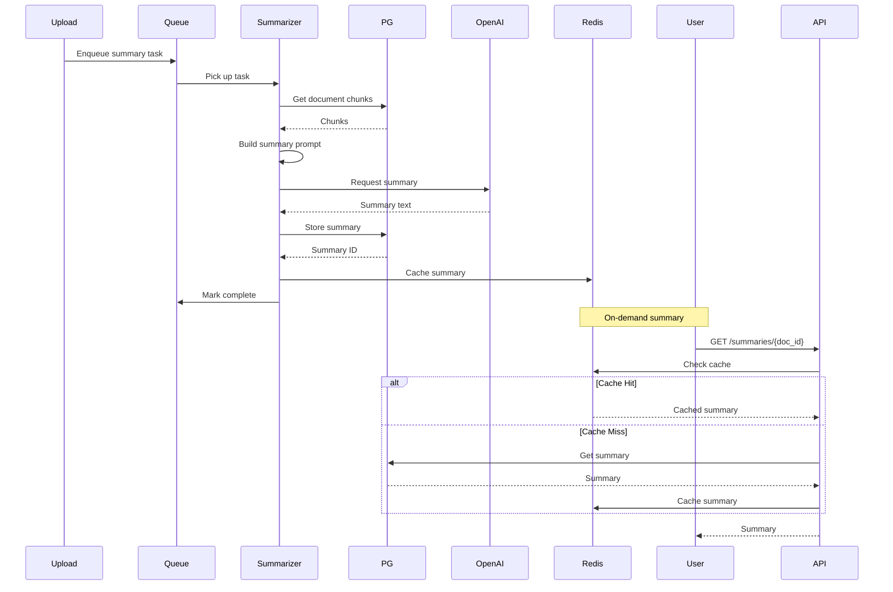
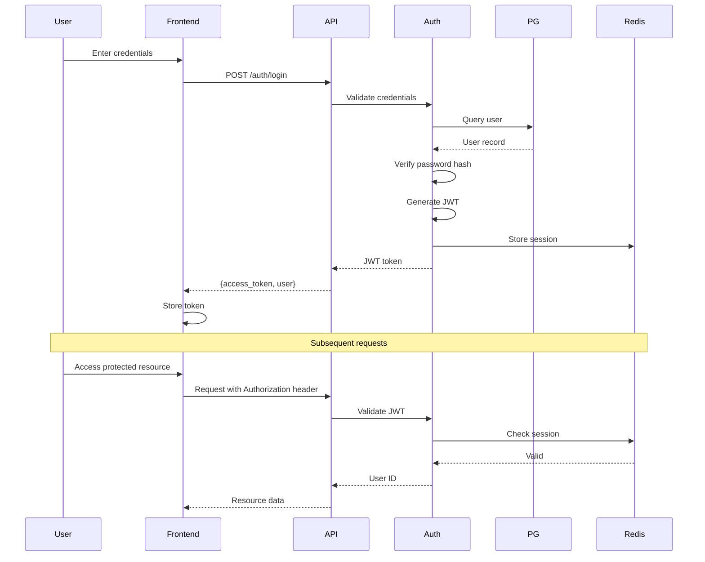
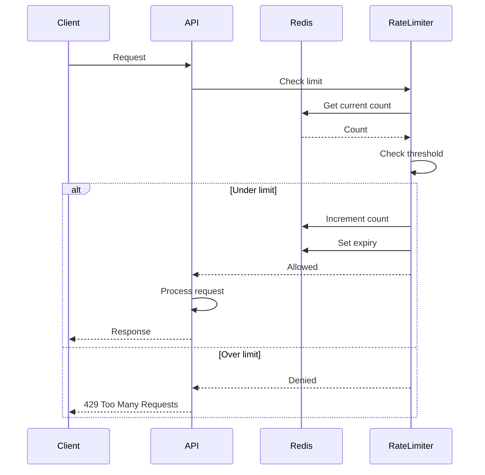
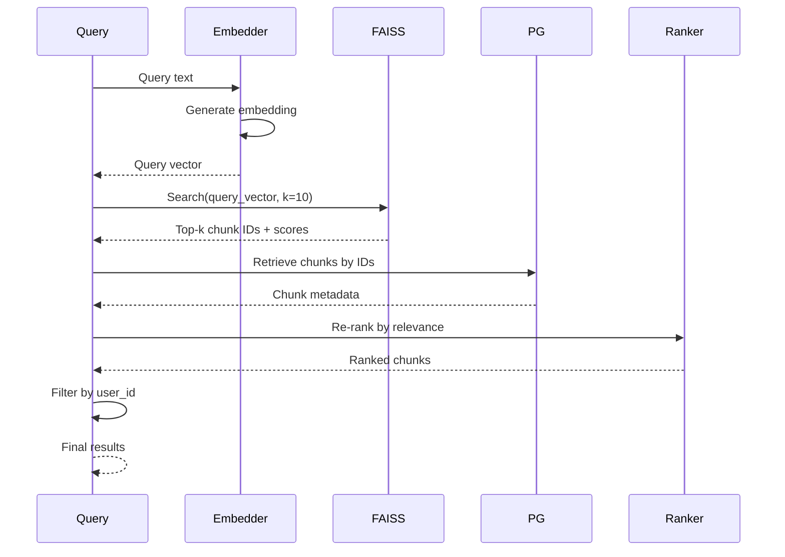

# Sequence Diagrams

## Upload Sequence Diagram

## Chat Query Sequence Diagram

## Timestamp Playback Sequence Diagram

## Summarization Pipeline Sequence Diagram

## Authentication Sequence Diagram

## Rate Limiting Sequence Diagram

## Vector Search Sequence Diagram

